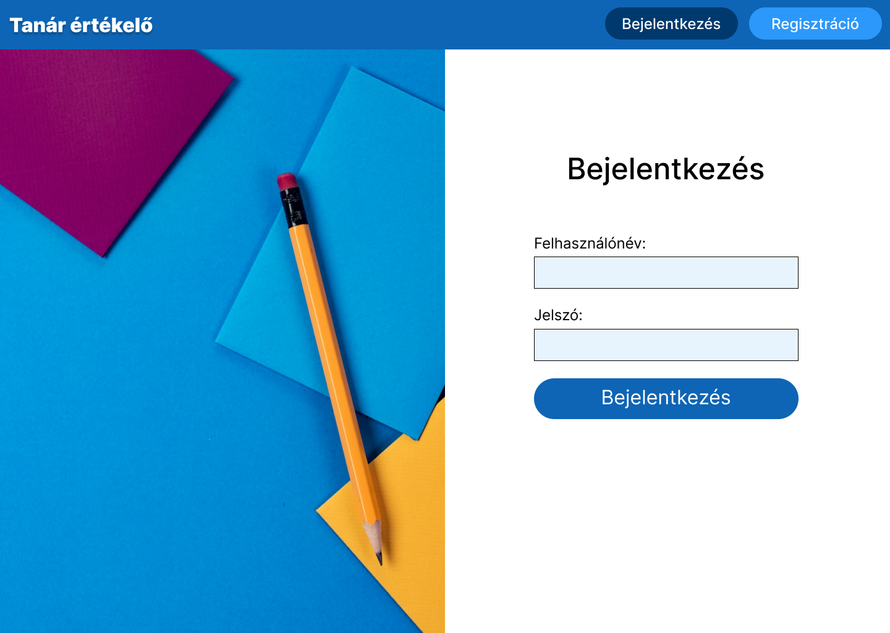
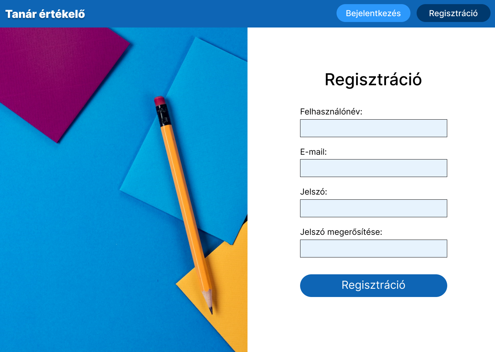
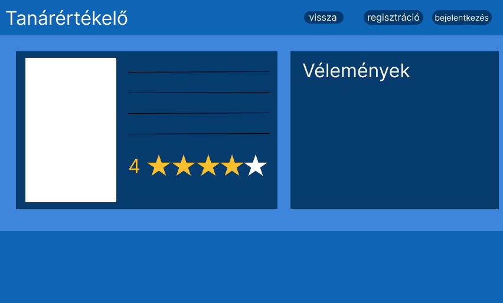

# Funkcionális Specifikáció
## 1. Jelenlegi helyzet

Jelenleg az elsőéves hallgatóknak nehéz feladatuk van abban, hogy eldöntsék melyik oktatóhoz vegyék fel az adott tantárgyaikat. A mostani rendszerben nincs megfelelő
lehetőség véleményt szerezni. Csupán ismerettség alapján vagy találomra választanak tanárokat. Ezt szeretnénk megkönnyíteni azzal, hogy létrehozunk egy olyan weboldalt, ahol
a hallgatók hasznos információkat találnak az egyetem oktatóiról.

## 2. Vágyálom rendszer

A projekt célja az, hogy a hallgatók információkat szerezzenek adott oktatókról más hallgatók véleménye, és tapasztalati alapján. Az oldalnak átláthatónak és könnyen navigálhatónak kell lennie. Ezzel is könnyítve az új tanulók dolgát. Az alkalmazás funkciói: regisztráció, bejelentkezés, oktatók értékelése, valamint véleményezése.

## 3. Jelenlegi üzleti folyamatok modellje

Jelenleg a hallgatók az általuk ismert hallgatóktól tudnak véleményt kérni bizonyos oktatókról, azonban ha valaki úgy érkezik meg ebbe a közegbe, hogy nincs ismerőse, akkor ez elég korlátozott tud lenni. Így nem biztos, hogy a számukra megfelelő döntést tudják hozni, és rosszul választják meg az oktatókat. Meg tudják nézni a tanárokat a MarkMyProfessor oldalon, azonban ott nem szerepel minden tanár. A weblap bizonyos számban fedi le őket. Új tanárt a hallgatóknak kell felvenniük, alapértelmezetten nem szerepel az összes oktató a rendszerben.

## 4. Igényelt üzleti folyamatok modellje

Egy olyan weboldal, amely átlátható, alkalmas felületet nyújt a hallgatóknak az oktatók véleményezésére, értékelésére. Az alapmodellre épülő oldalunk a következőket tartalmazza:

 - Bejelentkezés
 - Regisztráció
 - Oktatók megjelenítése
 - Oktatók értékelése, véleményezése

## 5. Követelménylista

| ID | Modul | Név | Kifejtés |
| :---: | --- | --- | --- |
| K1  | Szerver | Adatbázis  | Adatok tárolása |
| K2  | Felület | Regisztráció  | Felhasználó regisztrációja |
| K3  | Felület | Bejelentkezés  | Felhasználó bejelentkezése |
| K4  | Felület | Oktatók  | Oktatók megjelenítése |
| K5  | Felület | Információ | Információk az oktatókról |
| K6  | Felület | Értékelés  | Értékelés az oktatókra |
| K7  | Felület | Vélemény | Vélemények az oktatókról |

## 6. Használati esetek

A felhasználó a főoldalon láthatja az összes tanárt kártyák formájában megjelenítve. Külön ki tud választani egy oktatót a kártyán lévő gombra kattintva, hogy ha bővebb információt szeretne kapni. Ezt követően a főoldal elnavigálja a hallgatót egy olyan oldalra, ahol már csak az adott tanár jelenik meg. Ezen az oldalon lehet véleményt írni vagy értékelni. Valamint ezen a felületen tudja elolvasni mások véleményét és látja, hogy milyen értékeléseket kapott az adott oktató.  

## 7. Megfeleltetés, hogyan fedik le a használati eseteket a követelményeket

|ID|Leírás           |
|-------------------------|---------------------------|
|K1|Az oktatók és a bejelentkezett felhasználók adatait adatbázisban tároljuk. Az oktatókról eltároljuk a nevet, a szakot, hogy mit tanít, milyen értékeléssel rendelkezik és, hogy milyen véleményeket írtak róla. A felhasználókról a nevet, az e-mail címet és a jelszót tároljuk el.|          
|K2|A felhasználónak regisztrálnia kell ha véleményt szeretne írni, vagy ha értékelni szeretne egy adott oktatót. Név, e-mail cím és jelszó megadásával teheti meg ezt.|
|K3|A felhasználó a regisztrált e-mail címet és jelszót használva tud bejelentkezni az oldalra. Ezután lesz elérhető számára az értékelés és a vélemény írás.|
|K4|A főoldalon jelennek meg az oktatók kártyás elrendezésben. Minden oktatónak lesz egy külön oldala, ahol több információt jelenítünk meg a hallgatók számára.|
|K5|Minden oktatónak lesz egy külön oldala, ahol több információt jelenítünk meg a hallgatók számára. Megjelenítjük, hogy milyen szakon tanít, milyen értékeléssel rendelkezik és azt, hogy más hallgatók milyen véleménnyel vannak az adott oktatóról. |
|K6|A felhasználó bejelentkezés követően jogosult lesz arra, hogy értékelje a tanárokat.|
|K7|A felhasználó bejelentkezés követően jogosult lesz arra, hogy véleményezze a tanárokat.|

## 8. Képernyő képek

## 9. Forgatókönyv

## 10. Funkció - követelmény megfeleltetése

 | Id | Követelmény | Funkció |
 | :---: | --- | --- |
 | K1  | Hibamentes működés, 3NF| Az adatbázis a megfelelő normálformában van. |
 | K2  | Hibamentes működés, letisztult megjelenités, ellenőrzött regisztráció| A felhasználók ellenőrzött módon tudnak regisztrálni az oldalra. Adott feltételeknek megfelelő e-mail címet és jelszót adnak meg. Megfelelő módon kerülnek tárolásra a megadott adatok az adatbázisban. |
 | K3  | Hibamentes működés, letisztult megjelenités, ellenőrzött bejelentkezés| A regisztrált e-mail cím és a hozzá tartozó jelszó megadását követően az oldal bejelentkezteti a hallgatót a felületre. |
 | K4  | Hibamentes működés, letisztult megjelenités| Tisztán, elkülöníthetően és rendezett módon jelennek meg az oktatók a főoldalon. |
 | K5  | Hibamentes működés, letisztult megjelenités| Minden tanárnak lesz egy külön oldal, ahol több dolgot is olvasthatnak majd a felhasználók. |
 | K6  | Hibamentes működés, letisztult megjelenítés | Bejelentkezést követően értékelést is lehet küldeni az oldalra. Az értékelés az adatbázisban tárolódik el az adott felhasználó és az adott oktató kapcsolatában. |
 | K7  | Hibamentes működés, letisztult megjelenítés | Bejelentkezést követően véleményt is lehet küldeni az oldalra. A vélemény az adatbázisban tárolódik el az adott felhasználó és az adott oktató kapcsolatában. |

## 11. Fogalomszótár

* **Normálforma:** A harmadik normálforma (3NF) egy adatbázisséma, amely kapcsolódik a relációs adatbázisokat használó normalizáló elvekhez, amely csökkentse a párhuzamos adatokat, elkerülje adatok anomáliáit és hibáit, biztosítják a hivatkozási integritást és egyszerűsítsék az adatkezelést.
*  **Hallgató és oktató kapcsolata:** Mivel egy hallgató több oktatót is értékelhet, véleményezhet és egy oktatót több hallgató értékelhet kapcsolótáblát kell használni az adatbázisban elkerülve a több-több kapcsolatot. Hiszen azt közvetlenül nem lehet tárolni a relációs adatbázisokban, mert az megsértené a normalizációs elveket. 
