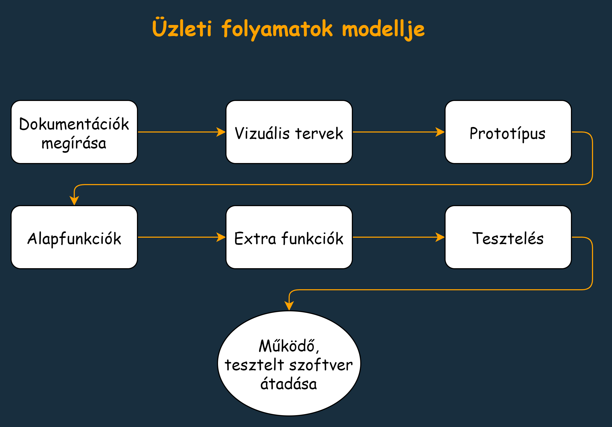

## 1. A rendszer célja
A Professzorok azt a megbízást kapta, hogy segítsék az új hallgatókat az első tantárgyfelvételnél, úgy hogy a számukra legmegfelelőbb oktatóhoz tudják felvenni a szükséges tárgyakat, valamint kurzusokat. 
Célunk egy olyan értékelő- és véleményező oldal kialakítása, amely átlátható módon informálja a hallgatókat az oktatókról, amelyeket más hallgatók értékelnek, valamint véleményeznek. Ez nem csupán az elsőéves hallgatókat tudja segíteni, hanem általánosan mindenkinek egy könnyen elérhető lehetőséget biztosít, így kényelmesebbé téve a tárgyfelvételt.
## 2. Projektterv
   
### 2.1 Projektszerepkörök, felelőségek
* Scrum master:
  -   Herbák Marcell 
* Product owner:
  -   Herbák Marcell 
* Üzleti szereplő:
  -  Györkis Tamás
### 2.2 Projectmunkások és felelősségek
* Frontend:
  - Szkleván Richárd
  - Szabó Richárd
* Backend:
  - Seres Szabolcs
  - Vastag Demeter

### 2.3 Ütemterv
|Funkció                  | Feladat                   | Prioritás | Becslés (nap) | Aktuális becslés (nap) | Eltelt idő (nap) | Határidő (nap) |
|-------------------------|---------------------------|-----------|---------------|------------------------|------------------|---------------------|
|Követelmény specifikáció |Megírás                    |         1 |             2 |                      2 |                1 |                   2 |
|Funkcionális specifikáció|Megírás                    |         1 |             2 |                      2 |                0 |                   2 |
|Rendszerterv             |Megírás                    |         1 |             2 |                      2 |                0 |                   2 |
|Program                  |Vizuális tervek elkészítése|         2 |             1 |                      0 |                0 |                   1 |
|Program                  |Prototípus elkészítése     |         3 |             3 |                      0 |                0 |                   3 |
|Program                  |Alapfunkciók elkészítése   |         3 |             5 |                      0 |                0 |                   5 |
|Program                  |Extra funkciók elkészítése |         3 |             3 |                      0 |                0 |                   3 |
|Program                  |Tesztelés                  |         4 |             2 |                      0 |                0 |                   2 |

## 3. Üzleti folyamatok modellje

### 3.1 Üzleti szereplők
Az oldalon regisztrálni kell a felhasználónak ha értékelést vagy kommentet szeretne írni az oktatóról. A weboldal meglátogatásához nincsen szükség semmilyen szoftver letöltéséhez vagy megvételéhez.

### 3.2 Üzleti folyamatok
A weboldal meglátogatása után azonnal használható. A felhasználó megtegintheti az összes eddigi értékelést és kommentet az oktatókról, ha szeretne regisztráció és bejelentkezés után saját értékelést és véleményt adhat hozzá.

## 4. Követelmények
### Követelménytáblázat
|  ID  |  Modul  |  Név  |  Kifejtés  |
| :--: | :-----: | :---- | :--------- |
| K1   | Szerver | Adatbázis | Adatok tárolása |
| K2   | Felület | Regisztráció | Felhasználó regisztrációja |
| K3   | Felület | Bejelentkezés | Felhasználó bejelentkezése |
| K4   | Felület | Oktatók | Oktatók megjelenítése |
| K5   | Felület | Információ | Információk az oktatókról |
| K6   | Felület | Értékelés | Értékelés az oktatókra |
| K7   | Felület | Vélemény  | Vélemények az oktatókról | 

### Funkcionális
- A regisztráció során adatok eltárolása az adatbázisba
- Bejelentkeztetés során az adatbázisban lévő felhasználó adatainak pontos összehasonlítása a felhasználó által megadottakkal
- Az oktatók adatainak betöltése a főoldalra
- A tanárok értékelésének helyes kiszámítása
- A kommentszekció helyes működése

### Nem funkcionális
- Az adatbázisból az adatok megfelelően legyenek megjelenítve és lekérdezve
- Gyors és folyamatos szerver és kliens kommunikáció

## 5. Funkcionális terv

### 5.1 Rendszerszereplők
Az oldal a felhasználó számítógépén érhető el.

### 5.2 Menü-hierarchia
  - Navigációs sáv: Itt navigálhatunk a különféle oldalak között.
  - Bejelentkező, Regisztráció oldal: Értékelés és vélemény írásához szükséges egy felhasználói profil.
  - Főoldal: Az adatbázisban szereplő tanárok megjelenítése
  - Mellékoldal: Miután a főoldalon kiválasztottuk melyik tanár profilját szeretnénk megteginteni itt megjelennek az adott tanár adatai, az eddigi értékeléseinek összesítése és a róla alkotott vélemények komment formában. Valamint ezen az oldalon tud maga a felhasználó is értékelni és véleményezni.

## 6. Fizikai környezet
### Hardver környezet
Minden régebbi és új Windowst támogat ami tudja futtatni megfelelően a weboldal egyes komponenseit.
### Fizikai alrendszerek
A követelményeknek megfelelő, Windows-ra alkalmas számítógépek, amik tudják futtatni a Visual Studio Code-t.
### Fejlesztői eszközök
Visual Studio Code.

## 7. Architechtúrális terv
A program képes futni bármely böngészőben egy internetelérésre alkalmas eszközön. Az alkalmazás futtatásához tehát szükség lesz internetkapcsolatra és egy háttér adatbázisra az adatok tárolására és kezelésére.
## 8. Adatbázis terv
(../Img/AdatbázisTerv.png)
## 9. Implementációs terv
   * Felhasználói felület: Webes alkalmazás
   * A program egy böngészőablakban fut, az elrendezést HTML és CSS segítségével oldjuk meg. PHP-val kérdezünk le és módosítunk adatokat az adatbázisban. Az adatbázist pedig a MySQL adatbázis-kezelő rendszerben tároljuk, ezt phpMyAdmin segítségével kezeljük.
## 10. Tesztterv
A szoftvert/weboldalt teszteljük még mielőtt eljuttatnánk a megrendelőhöz. Tesztnaplót vezetünk amely segítségével tudjuk követni, hogy hol és milyen hibákat tartalmaz a program. A tesztnaplóba feltüntetjük azt is
hogy miket teszteltünk a programban is nem csak a hibás részeket.
## 11. Telepítési terv
   * Fizikai telepítési terv: Az alkalmazás üzemeltetéséhez szükséges egy távoli webszerver és adatbázis, ezeket a szolgáltató üzemelteti. A felhasználónak csupán internetkapcsolatra és egy modern böngészőre van szüksége.
   * Szoftver telepítési terv: Az alkalmazást nem kell külön telepíteni, bármely böngészőben elfut egy internetelérésre alkalmas eszközön.
## 12. Karbantartási terv
Miután eljuttatjuk a megrendelőnek az alkalmazást nem fejezzük be a fejlesztését mert egy jó szoftver életciklusa nem ér véget a lefejlesztés végével. 
Mindig lehetnek újabb funkciók, új igények amelyeket le kell fejleszteni vagy
karbantartani az alkalmazást.

